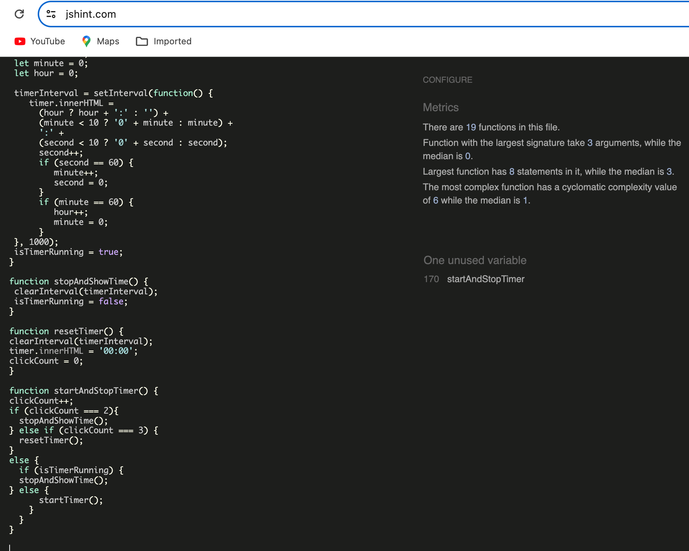

# Project 2

#### Introduction on how I approached the project:
Due to Job time constraints (at least 10h/day between January and now), which can happen from time to time in my area (Drug development/Medical Oncology), 4 weeks to prepare for project 2 was a challenge. Therefore, when I thought about how to approach this project and googled, what the Rock-Paper-Scissors-Lizard-Spock Game was all about and what such a thing would look like, I was lucky to find the project from Danny22 on GitHub (https://dannyhsl22.github.io/Rock-Paper-Scissors-Lizard-Spock/).

Although I very well understand, that one should develop one’s skills and ideas, but given the circumstances, I nevertheless decided to use this as a template and guidance. Additionally, the option to discuss specific circumstances with a real person in the CI is difficult to achieve, unless one has technical problems, I decided, therefore, to move forward with the project with the help of this template to the best of my abilities in the timeframe which was left.

#### What I decided to do:
* Slightly restructure the appearance according to my style (my mentor told me, that HTML and css in project 2 are of minor importance, therefore I stayed away from completely restructuring the whole page and only added and rearranged some parts)
* Learn and understand the Java script codes of this template, which was not particularly easy, because it was completely unordered
* Rewrite the Java script codes to develop my JS codes and add new ones
I am aware, that my reliance on a template is probably not intended, but I decided to submit this project nevertheless and be honest about it. My hope is, that at least, I could show, that I could write my own Java script codes, which Project 2 is all about. If it turns out that this is not enough, I would be grateful to be able to discuss next steps with somebody.

# Rock-Paper-Scissors-Lizard-Spock - Game

[Please View the live project here](https://elisabethoelmann.github.io/Project2/)

Rock paper scissors (commonly scissors, paper, rock or stone in Australia and New Zealand) is an intransitive hand game usually played between two people, in which each player simultaneously forms one of three shapes with an outstretched hand. These shapes are "rock" (a closed fist), "paper" (a flat hand), and "scissors" (a fist with the index finger and middle finger extended, forming a V). The earliest form of "rock paper scissors"-style game originated in China and was subsequently imported into Japan, where it reached its modern standardized form, before being spread throughout the world in the early 20th century. [Wikipedia] (https://en.wikipedia.org/wiki/Rock_paper_scissors)

Rock Paper Scissors Lizard Spock is the same game, however, expanded with Lizard and Spock. This expanded form of the game was first used in the Big Bang Theory TV series, to settle a dispute about what to watch on TV between Sheldon and Raj in "The Lizard-Spock Expansion" (see rules below)

## UX
The aim was to create an interactive game Rock, Paper, Scissors Lizard Spock where the player challenges the computer.
* The header, 
        * Displays the title and
        * A  "How to Play"  button, where the player can see the rules of the game:
            * The game Rules:
                    *Rock crushes Scissors
                    *Rock crushes Lizard
                    *Paper beats Rock
                    *Paper disproves Spock
                    *Scissors beats Paper
                    *Scissors decapitate Lizard 
                    *Lizard poisons Spock
                    *Lizard eats Paper
                    *Spock vaporizes Rock
                    *Spock smashes Scissors

* The Play-action area underneath the header of the page, tells the player to choose from the buttons underneath: there are the 5 choice pictures/buttons for each of the options to choose from:
        * Button 1 will have the word Rock, and an icon showing the diamond picture.
        * Button 2 will have the word Paper, and an icon showing the paper picture.
        * Button 3 will have the word Scissors, and an icon showing the scissors picture.
        * Button 4 will have the word Lizard, and an icon showing a Lizard picture.
        * Button 5 will have the word Spock, and an icon showing the Spock picture.
        * Buttons have a glow effect to show the player they clicked the wanted button, with different colours based on winning, losing, or if it is a draw.
        * Once the player has pressed one of the choice buttons, the code will generate a random choice to reflect the computer choice and the outcome of the cchoices and results will also be shown immediately in the play-action area as well as in the scoring area.
        * If the player wins, the code will add 1 to the player's score and update the results with "You win!".
        * If the computer wins, the code will add 1 to the computer's score and update the results with "You lost!".
        * If the player and computer select the same choice, this will be a draw and the scores will not update. 
        The result display will show "It's a Tie!".
        * I have also introduced a reset button for the game to give the player the chance to start from scratch again.

* The score area underneath the choices area, counts the results of the game showing in the “Player” and “Computer”  box underneath the images. The scores will increment by 1, as explained above, when either the user or computer wins.

* The Timer at the bottom of the screen gives the option to see how quickly you can beat the computer.
There is a button for starting, stopping and resetting the timer to show how much the user can score to beat the computer:
        * On the 1st click, the time would start
        * On the 2nd click the timer will stop
        * On the 3rd click the the timer would reset itself 
If the button is pressed once, the code will start counting the seconds and time will be displayed in the “Time taken” area 

### Strategy
I liked the simplicity of the design, which was one of the reasons for me to choose this game as a template, which included minimalist but useful information with eye-catching images. I adapted the colours and images and reorganized the page so that the play action area with a clear instruction to the player comes first on top of the choices to be made so that it is easy to see the choices/results and score area together even on small screens without scrolling a lot. This website is aimed to attract all demographics with an interest in playing a quick simple game.

### Scope
For the players, I wanted to provide them with instructions on how to play the game with buttons, that have pictures to show the options. The game has a responsive design so it should function correctly across various devices such as Desktop, Mobiles, Tablet, and Laptop.

### Structure
I wanted the game to be eye-catching and fun with instructions on how to play the game.

### Skeleton
I started amending the design via PowerPoint.

### Surface
#### Images
The images came from various sources and the links can be found at the end of this document
* as a rock I chose a picture of a crystal found on Etsy: 

* as paper I chose a crumbled paper piece:

* as scissors, I used an icon:

 * The lizard picture  was taken from a glossy garden Gecko Ornament, which one can buy at Amazon: 

* The Spock picture came from a Mr. Spock picture found on eBay: 

### Typography
I decided to use "Annie use your Telescope" for the header and "EB Garamont" for the main body text, both from Google Fonts.

### Technologies
#### Languages
    * HTML
    * CSS
    * JavaScript

### Libraries:
    * Google fonts

## Features
### Header

The top of the page shows the game name as the title of the game: Rock Paper Scissors Lizard Spock.
I chose a playful font that also contrasts nicely with the light beige background and should also be appealing to children.

Underneath the title comes the "How to Play"  button, where the player can see the rules of the game:
    

   
### Body
   #### "Start the action" area:

   Underneath the "How to play" box, comes the start/play/action area, which tells the player to make their choices by clicking on the pictures. When they do that, they can see immediately the window popping up, showing how successful they were:
   

   #### The choices and scores area:

   * The choices area:
        *This is the area of the pictures, on which the player will choose to click: either Rock Paper Scissors Lizard or Spock.

   * The scoreboard, showing the game results:
        * When the player clicks on a picture option, it will show a coloured box shadow, green for a win, red for a loss and yellow for a draw and a short message, that shows your choice and if you won, lost, or it is a draw, as described above.
        * The JavaScript code chooses a random option for the computer player, displays the image relating to the computer’s choice, and then determines, who the winner is, which shows in the scoreboard and the result box above the images.
            * The player score: will increment by 1 when the player has won the game.
            * The score is updated for either the player or the computer depending on who won or lost or none of them (draw).
        * if the player wants to reset the game, there is a reset button, which resets the game whenever the button is clicked to 0:0.
        * The time taken to beat the computer is shown here underneath the scoreboard if the player has been using the timer at the bottom of the page.
        

#### The timer area

    * A message above the timer bottom addresses the player: How quickly can you beat the computer – set the timer!       
   * Start/Stop/Reset timer button:
    The start/stop/reset timer button will start on the 1st click, stop on the second click and reset itself on the 3rd click.

   
### Testing
    * I have tested this game in Google Chrome and Safari as well as on my iPhone 15 mobile phone.
    * I tested the "How to Play" button and it correctly displayed the information in a pop-up box, including an X to close the box.
    * The picture choice buttons worked properly and each showed the relevant glow functions.
    * The result was shown correctly in the scoreboard, adding 1 to the player score if the player won, adding 1 to the computer score if the computer won, and not changing, if it was a draw between the 2 players.
    * Also the reset function of the scoreboard worked properly.
    * I then tested the timer by clicking once to start the timer, twice to stop the timer and 3 times to reset the timer. The Time taken was correctly updated every second.
  
### Bugs
   •    No Bugs were found, no errors were reported

 ### Validator Testing
        * W3C Markup Validation

        * W3C CSS Validation

        * JSHint

        *Esprima JS validation

   
### Deployment
   This website is hosted through GitHub and is deployed directly from the main branch. The deployed site will only update when new commits to the main branch have been pushed to GitHub.
   GitHub Pages
   The project was deployed to GitHub Pages using the following steps:
   1.   Log in to GitHub and open the GitHub Project 2 Repository
   2.   Click on 'Settings'
   3.   Scroll down and click on 'Pages' on the left-hand side menu.
   4.   Select the 'Branch' 'master' and click on 'Save'.
   5.   Allow GitHub a few minutes to deploy the website and then refresh the page.
   6.   Website deployed.
   
   
### Credits
   #### Media
   * All the pictures were found on the links given at the bottom of this page

   * a big thanks to Dannyhsl22 for providing unknowingly this template

   * a big thanks also to the CI tutors, who were very helpful in guiding me when I got stuck
   
#### Sources of the images
* as a rock I chose a picture of a crystal found on Etsy: 

    https://www.etsy.com/uk/listing/1492479757/rainbow-quartz-gem-set-of-10-clipart?gpla=1&gao=1&&utm_source=google&utm_medium=cpc&utm_campaign=shopping_uk_en_gb_e-craft_supplies_and_tools-other&utm_custom1=_k_CjwKCAiA8YyuBhBSEiwA5R3-E_q5pT3Rj0RpyxoVwSiks9TWsWL2PiXwYlEtXkw6Lhm3tq0kOSpY_BoCs9MQAvD_BwE_k_&utm_content=go_12576471592_123222676521_507650079487_pla-295462056907_c__1492479757engb_102858184&utm_custom2=12576471592&gad_source=1&gclid=CjwKCAiA8YyuBhBSEiwA5R3-E_q5pT3Rj0RpyxoVwSiks9TWsWL2PiXwYlEtXkw6Lhm3tq0kOSpY_BoCs9MQAvD_BwE

* as paper I chose a crumbled paper piece:
    https://create.vista.com/unlimited/stock-photos/324644144/stock-photo-top-view-empty-orange-crumpled-paper-white-background/

* as scissors, I used an icon:
    https://www.shutterstock.com/search/cartoon-scissors

* The lizard picture  was taken from a glossy garden Gecko Ornament, which one can buy at Amazon: 
    https://www.amazon.co.uk/Vivid-Arts-Glossy-Garden-Ornament/dp/B07FNR1946/ref=asc_df_B07FNR1946/?tag=googshopuk-21&linkCode=df0&hvadid=255669553334&hvpos=&hvnetw=g&hvrand=7705280809345769808&hvpone=&hvptwo=&hvqmt=&hvdev=c&hvdvcmdl=&hvlocint=&hvlocphy=9046733&hvtargid=pla-556052025839&psc=1&mcid=ae9ee51ff7a735e49b661c4bfcdad036

* The Spock picture came from a Mr. Spock picture found on eBay: 
    https://www.ebay.co.uk/itm/265811245166?chn=ps&_ul=GB&norover=1&mkevt=1&mkrid=710-134428-41853-0&mkcid=2&mkscid=101&itemid=265811245166&targetid=2270718620605&device=c&mktype=pla&googleloc=9046733&poi=&campaignid=20938568783&mkgroupid=160131055320&rlsatarget=pla-2270718620605&abcId=9367980&merchantid=119021160&gclid=CjwKCAiA8YyuBhBSEiwA5R3-E0NAH1nALJhD71zljfOxhRDjL_sEHRsHOxjnWOdYRsBrU9J9Mj7AjhoCF_EQAvD_BwE
